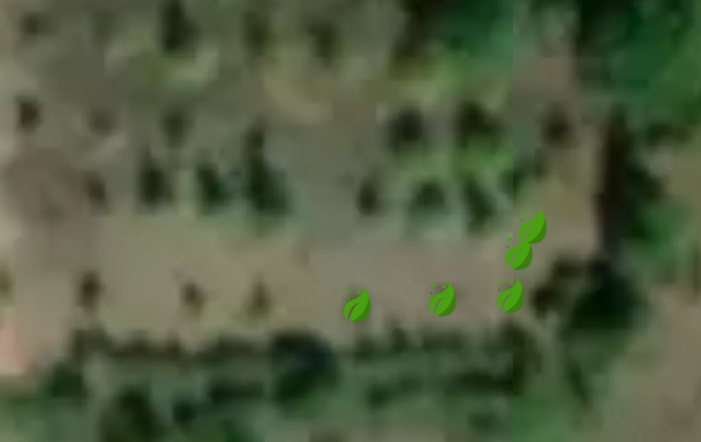
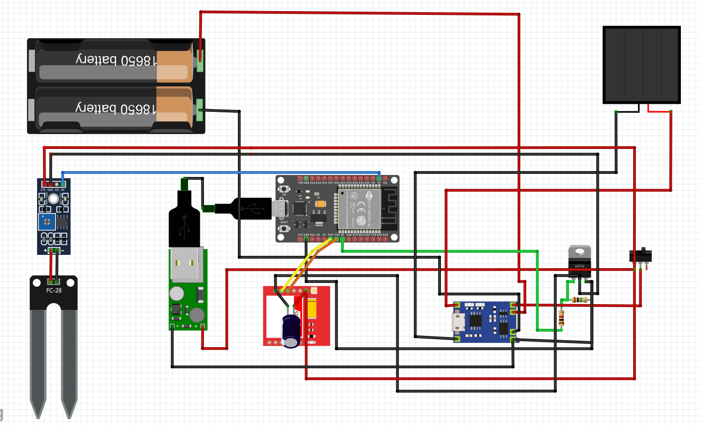
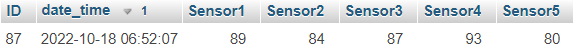
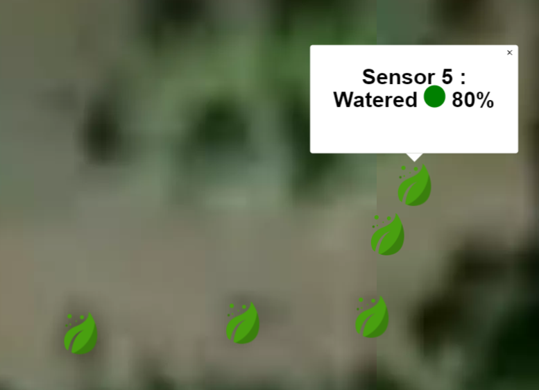

# Plant Watering
## Overview
A system that can be used to remotely check the watering status of some plants. The system is being currently used for some plants of my family, one hour away from our home: [Website](http://pliamprojects.000webhostapp.com/plants/)

## Hardware

The main components used for this project are:
* ESP32 DevKit V1 (because I first tested the system with Wi-Fi)
* SIM800L GSM Module
* Soil Moisture Sensors and Hygrometer Modules

The (5 at the time) sensors are connected to the same ESP32 module (via long wires), which is the one that sends the data to a database 
The solar-powering system consists of the following:
* 2x Li-Ion 18650 Batteries
* 5V 0.5W Solar panel
* 2x 18650 3200mAh 3.6V Li-Ion batteries
* TP2056 Li-Ion battery charging module that is connected to the solar panel and the battery
* 5v USB booster converter module
* A MOSFET that controls the power of the sensors and the GSM module
* 220uF capacitor to achieve the 2A surge current needed by the GSM module

The connections are depicted on the following circuit:

## Software/Control

The ESP-32 gets the values from the sensors (the average of 500 fast consecutive measurements to eliminate errors) and sends them to an online database using some [PHP files](Website/post_moisture_esp.php).

[Arduino Code](Arduino/Moisture_Control_GSM/Moisture_Control_GSM.ino)

Because because power consumption was a main concern, I used the sleep mode of ESP32 and set it so that it sleeps for 12 hours after sending data. 
As the field where I wanted to install the sensors is in a remote area where there isn’t some Wi-Fi source near it, I concluded that I should use a GSM module directly connected to the ESP-32, as well as a MOSFET that could turn it off when not needed. I also used this MOSFET to switch the power of the sensors on and off when the ESP-32 is in sleep mode.

## Database

The data of the sensors are stored in a database, as shown below:

## Website ([Link](http://pliamprojects.000webhostapp.com/plants/))

The website with which I check the watering of the plants contains a map with some markers, that correspond to the sensors and show the value of the sensor and the watering status represented with colors and “Watered” or “Dry”.

[Website Code](Website/index.php)

